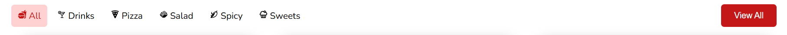
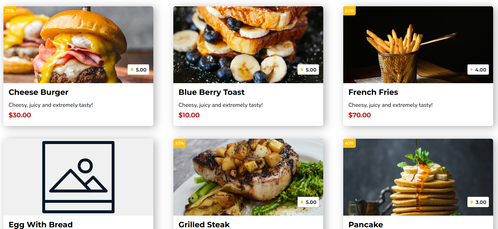

# Fast Food Menu with React

This is a basic webpage created using React with JavaScript

## Table of Contents

1. [Features](#features)
2. [Live Demo Site](#live-demo-site)
3. [Getting Started](#getting-started)

## Features

- Header



- Food Listings



## Live Demo site

Visit the site: [Food Commerce Interface Vercel](https://food-commerce-interface.vercel.app/)

## Getting Started

- Fork the repo
- Clone it from your personal forked repo
- Install dependencies:

  ```bash
  npm install
  ```

- Run the site locally:

  ```bash
  npm run dev
  ```
